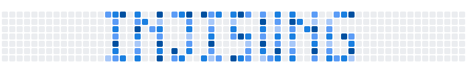
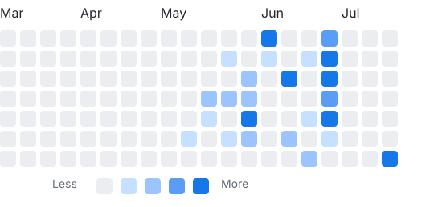
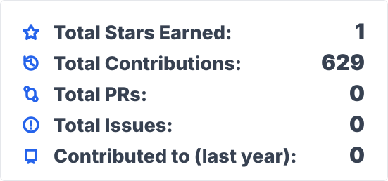

### Designing what users see

보이는 것을 설계하는 개발자

### About Me

대구소프트웨어마이스터고에서 **프론트엔드**를 전공하고 있습니다. 
**React**와 **Figma**로 화면을 만들고, 부전공인 **서버·보안** 지식으로 서비스의 안정성을 더합니다.

### Tech Stack

  
  
  
  
  

  
  

### GitHub Stats

  
  

### Music

### GitAnimals

<!-- 소셜 링크 -->

  
  &nbsp;&nbsp;
  

